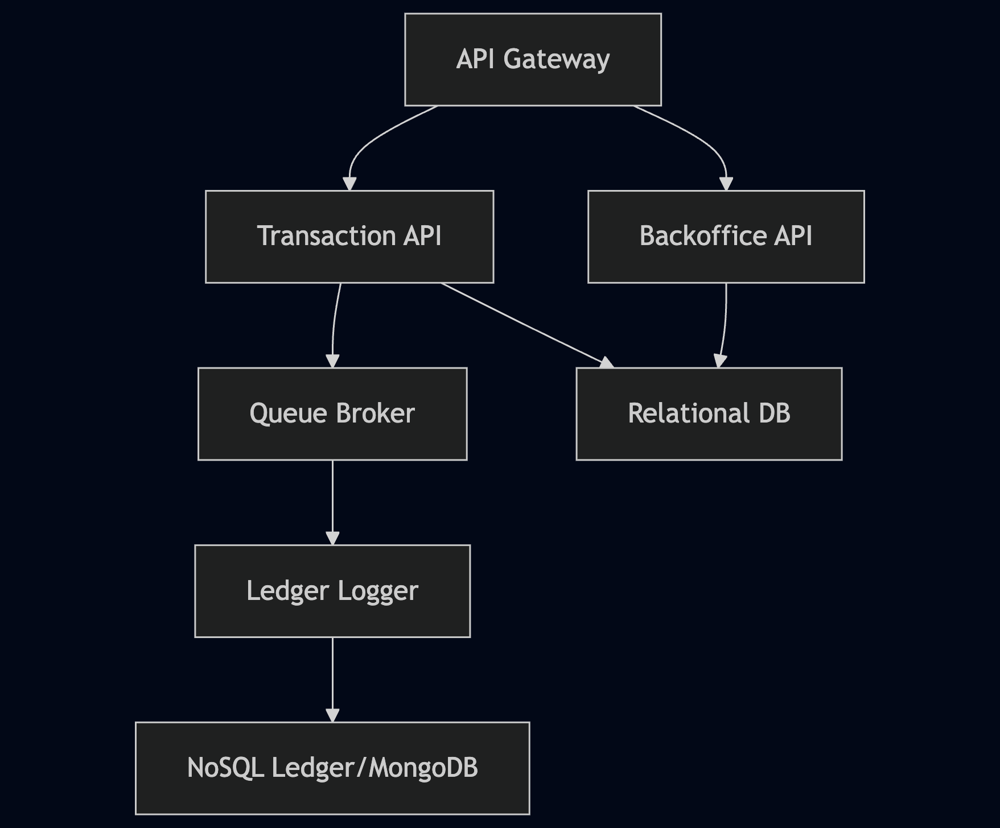

## Project structure:




--- 

## Project Run:
- Make the deployment script executable.
``` chmod +x run.sh ```

- Deploy to your Kubernetes cluster.
make sure run.sh is executable in your machine.
``` ./run.sh ```

- Postman Collection is available in the root directory.
- Swagger Documentation is available at root/docs for each service


---

## Service Overview

- **API Gateway:** Central entry point for routing external requests to backend services.
- **Transaction API:** Handles all financial transactions and balance operations.
- **Backoffice API:** Manages users, permissions, and application settings.
- **Queue Broker:** NATS-based message broker for reliable, exactly-once event delivery.
- **Ledger Logger:** Processes and logs transactions for auditing and compliance.
- **NoSQL Ledger (MongoDB):** Stores transaction records and ledger data.

---

## Key Features

- **Event-driven architecture** with exactly-once delivery guarantees.
- **Persistent messaging** with JetStream.
- **Subject validation** for NATS topics before publishing.
- **Floating-point precision** for monetary values.
- **Modular microservices** for scalability and maintainability.
